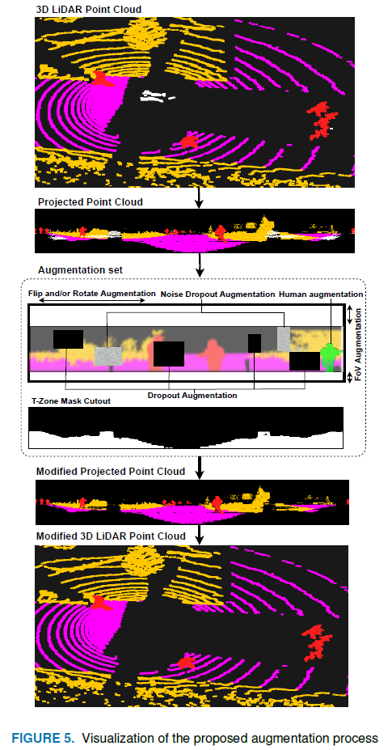

# Getting Started
This document provides a brief intro of the usage of DAPS3D.
## Training
- Make shure to cteate conda environment and setup wandb.login for training (See [Installation](./INSTALL.md)).

- Select desired augmentation setup inside [`augmentation.yml`](./cfgs/augmentation.yml). You can find more detailed description and different augmentation setups in our [Paper](). 



- We have different configs for our models: [`salsanext.yml`](./cfgs/salsanext.yml), [`ddrnet23_slim.yml`](./cfgs/ddrnet23_slim.yml) & [`segformer.yml`](./cfgs/segformer.yml). You can change hyperparameters there before training.

### Train Commands
This is default command structure for training:
```bash
./train.sh -d <path/to/dataset> \
           -f <path/to/configs> \
           -a <path/to/model_config> \
           -m <model_name> \
           -l <path/to/save/logs> \
           -p <path/to/pretrained/logs> \
           -c <gpu to run>
```
You need to choose `<model_name>` between: `salsanet`,  `salsanet_rec`, `salsanet_rec_lstm`, `salsanext`, `salsanext_rec_lstm`, `ddrnet` or s`egformer`.

**SalsaNet**

With default config requires 6 GB on GPU
```bash
./train.sh -d /Dataset/ -f cfgs/ -a cfgs/salsanext.yml -m salsanet -l ./logs/ -c 0
```

**SalsaNetRec**

With default config requires 7 GB on GPU
```bash
./train.sh -d /Dataset/ -f cfgs/ -a cfgs/salsanext.yml -m salsanet_rec -l ./logs/ -c 0
```
**SalsaNetRecLSTM**

With default config requires 9 GB on GPU
```bash
./train.sh -d /Dataset/ -f cfgs/ -a cfgs/salsanext.yml -m salsanet_rec_lstm -l ./logs/ -c 0
```
**SalsaNext**

With default config requires 10 GB on GPU
```bash
./train.sh -d /Dataset/ -f cfgs/ -a cfgs/salsanext.yml -m salsanext -l ./logs/ -c 0
```
**SalsaNextRecLSTM**

With default config requires 14 GB on GPU
```bash
./train.sh -d /Dataset/ -f cfgs/ -a cfgs/salsanext.yml -m salsanext_rec_lstm -l ./logs/ -c 0
```
**DDRNet**

Change `MODEL.MOD` inside [`ddrnet23_slim.yml`](./cfgs/ddrnet23_slim.yml) to `'none'`, `'oc'` or `'da'` for different model configurations before run. 

With default config requires 2, 3 & 10 GB on GPU for `none`, `oc` & `da` respectively 
```bash
./train.sh -d /Dataset/ -f cfgs/ -a cfgs/ddrnet23_slim.yml -m ddrnet -l ./logs/ -c 0
```
**SegFormer**

With default config requires 11 GB on GPU
```bash
./train.sh -d /Dataset/ -f cfgs/ -a cfgs/segformer.yml -m segformer -l ./logs/ -c 0
```

## Inference
This is default command structure for inference:
```bash
./infer.sh -d <path/to/dataset> \
          -f <path/to/configs> \
          -l <path/to/pretrained/logs> \
          -m <model_name> \
          -p <path/to/save/predictions> \
          -s <split to inference> \
          -c <gpu to run>
```
Simple example (for DDRNet model):
```bash
./infer.sh -d /Dataset/ -f cfgs/ -l ./logs/ddrnet_aug-set-5+t-z/ -m ddrnet  -p ./logs/infer/ddrnet_aug-set-5+t-z -s valid -c 0
```

In order to calculate metrics for your predicrions, run [`eval.sh`](./eval.sh). Metrics will be saved in `iou.txt` inside your `<predictions folder>`:
```bash
./eval.sh -d /Dataset/ -f cfgs/ -p ./logs/infer/ddrnet_aug-set-5+t-z -s valid
```
## Pretrained Models

### Segmentation models trained and evaluated on SemanticKITTI dataset
All models are trained with augmentation set 5 without T-Zone (see our [Paper]())
| Model | $mIoU$, % | $IoU$[vehicle], % | $IoU$[human], % | $IoU$[surface], % | $IoU$[obstacle], % | Checkpoint |
|   :---| :---:   |  :---: |    :---:   |    :---:   |    :---:   |    :---:   |
| SalsaNet | 0.787 | 0.882 | 0.412 | **0.929** | **0.924** | [model](https://drive.google.com/file/d/1eHKGhjuOZDUT3m6bEePGi8BfVAm3upp7/view?usp=share_link) |
| SalsaNetRec | 0.789 | 0.855 | 0.488 | 0.913 | 0.900 | [model](https://drive.google.com/file/d/1DKCu5bd1xLhY6TNnt9Vulw0KiLcu7PXr/view?usp=share_link) |
| SalsaNetRecLSTM | 0.751 | 0.887 | 0.271 | <ins>0.927</ins> | <ins>0.920</ins> | [model](https://drive.google.com/file/d/1m3UxiRSErxxgl9oy6wZFUF5op1pj6iC3/view?usp=share_link) |
| SalsaNext | <ins>0.821</ins> | <ins>0.907</ins> | <ins>0.564</ins> | 0.905 | 0.907 | [model](https://drive.google.com/file/d/1LE-xa_imnkMWfVaTl78j3OlkRZg9qq9p/view?usp=share_link) |
| SalsaNextRecLSTM | **0.835** | **0.914** | **0.600** | 0.911 | 0.914 | [model](https://drive.google.com/file/d/1JRGJVvGx3pqCcPT1J4gdVZmH8GsQIPbO/view?usp=sharing) |
| DDRNet | 0.692 | 0.750 | 0.225 | 0.901 | 0.893 | [model](https://drive.google.com/file/d/1RD-4-6xCefSY4WGdY6josGjTtmtWvPcB/view?usp=share_link) |
| DDRNetOC | 0.687 | 0.739 | 0.222 | 0.900 | 0.889 | [model](https://drive.google.com/file/d/1vkAu0caizss13hqXwB3pag9yiQ-Odykq/view?usp=share_link) |
| DDRNetDA | 0.696 | 0.754 | 0.232 | 0.903 | 0.895 | [model](https://drive.google.com/file/d/1v0B4CkkK92486dEAht4vfbOxpsDvCBhI/view?usp=share_link) |
| SegFormer | 0.539 | 0.437 | 0.048 | 0.893 | 0.777 | [model](https://drive.google.com/file/d/1hdFsG89KH3ArN7xtSgsbkE56tnUStJBR/view?usp=share_link) |

### Segmentation models trained and evaluated on SemanticKITTI and RELLIS-3D datasets
All models are trained with augmentation set 5 with T-Zone (see our [Paper]())
| Model | $mIoU$, % | $IoU$[vehicle], % | $IoU$[human], % | $IoU$[surface], % | $IoU$[obstacle], % | Checkpoint |
|   :---| :---:   |  :---: |    :---:   |    :---:   |    :---:   |    :---:   |
| SalsaNet | <ins>0.832</ins> | 0.869 | 0.886 | **0.789** | **0.782** | [model](https://drive.google.com/file/d/1R9VgcyXU8h5qpKdrbZiMbmY2KU0FAfVH/view?usp=share_link) |
| SalsaNetRec | 0.808 | 0.858 | 0.847 | 0.763 | 0.766 | [model](https://drive.google.com/file/d/123L5iXFJVZpGJEzNaeTmtbvcIo4Qos8s/view?usp=share_link) |
| SalsaNetRecLSTM | 0.828 | 0.889 | 0.880 | <ins>0.770</ins> | <ins>0.774</ins> | [model](https://drive.google.com/file/d/1oEtCUYobnxEAyuXJk43AXtADLdoR4cSk/view?usp=share_link) |
| SalsaNext | <ins>0.832</ins> | <ins>0.904</ins> | <ins>0.906</ins> | 0.755 | 0.763 | [model](https://drive.google.com/file/d/18KXyRIyKHi4FmdBeHoBCbmDkPgFD5Ywy/view?usp=share_link) |
| SalsaNextRecLSTM | **0.833** | **0.908** | **0.916** | 0.748 | 0.760 | [model](https://drive.google.com/file/d/1WE8gvxUsrK9H8ijBmMIwlfBqoLH9boXJ/view?usp=sharing) |
| DDRNet | 0.706 | 0.759 | 0.654 | 0.685 | 0.725 | [model](https://drive.google.com/file/d/1bmgiVIDdfawC4UIKXCSiZnKug3EewAiM/view?usp=share_link) |
| DDRNetOC | 0.705 | 0.749 | 0.652 | 0.693 | 0.728 | [model](https://drive.google.com/file/d/1zKepOpjfqYLhrgYX5DBG6WJEwsbvwb8g/view?usp=share_link) |
| DDRNetDA | 0.658 | 0.715 | 0.471 | 0.716 | 0.731 | [model](https://drive.google.com/file/d/1S-p7VbpBntdEXYGaIfuUDbf6V_Hy7dsw/view?usp=share_link) |
| SegFormer | 0.533 | 0.448 | 0.423 | 0.616 | 0.643 | [model](https://drive.google.com/file/d/1c-crMj1EsbSJ2s7m9O9K--wWAHO3sP5v/view?usp=share_link) |

### Segmentation models trained and evaluated on DAPS-1 dataset
All models are trained with augmentation set 5 with T-Zone (see our [Paper]())
| Model | $mIoU$, % | $IoU$[vehicle], % | $IoU$[human], % | $IoU$[surface], % | $IoU$[obstacle], % | Checkpoint |
|   :---| :---:   |  :---: |    :---:   |    :---:   |    :---:   |    :---:   |
| SalsaNet | 0.867 | <ins>0.880</ins> | 0.646 | 0.989 | 0.953 |  [model](https://drive.google.com/file/d/1MeoWM69f3uEh2jZ1NFlYShc5IEYa4G-1/view?usp=sharing) |
| SalsaNetRec | 0.850 | 0.836 | 0.680 | 0.974 | 0.908 |  [model](https://drive.google.com/file/d/1I6AfgG4pGJZ59cbZYK0xRkH9WNMkPq26/view?usp=share_link) |
| SalsaNetRecLSTM | 0.862 | 0.878 | 0.632 | 0.988 | 0.949 |  [model](https://drive.google.com/file/d/1cxwkEZ-BX4Acxg5k_v-ofjNlRRp8zECB/view?usp=share_link) |
| SalsaNext | <ins>0.886</ins> | 0.878 | <ins>0.721</ins> | <ins>0.990</ins> | <ins>0.954</ins> |  [model](https://drive.google.com/file/d/16StA3dg5TNIs3x2MODkmF1SauzdRWe1q/view?usp=share_link) |
| SalsaNextRecLSTM | **0.932** | **0.929** | **0.830** | **0.994** | **0.974** | [model](https://drive.google.com/file/d/1nS4ZmECE-Fm9QPI5dg1-UGBx1rIYwInm/view?usp=sharing) |
| DDRNet | 0.690 | 0.773 | 0.126 | 0.977 | 0.886 |  [model](https://drive.google.com/file/d/1i-7LPWBdkwwwmoOob4mhi63VPhwsT9IK/view?usp=share_link) |
| DDRNetOC | 0.694 | 0.769 | 0.138 | 0.978 | 0.889 |  [model](https://drive.google.com/file/d/1wA3bYyySH3vbl1bQJnBjVrbrotbg-tsH/view?usp=share_link) |
| DDRNetDA | 0.691 | 0.770 | 0.129 | 0.977 | 0.886 |  [model](https://drive.google.com/file/d/1QkuXkKsX6nJQVgZk-xYKDfWze1uk-kxW/view?usp=share_link) |
| Segformer | 0.530 | 0.495 | 0.052 | 0.909 | 0.665 |  [model](https://drive.google.com/file/d/1kW9KI6KRwh5eWn1XBMW-N3BMRhndSRzN/view?usp=share_link) |

### Segmentation models evaluated on DAPS-2 dataset
These are inference results on [DAPS-2](./DATASET.md#daps-2) for the models listed in the following sections (see our [Paper]())

#### Models trained on SemanticKITTI
| Model | $mIoU$, % | $IoU$[human], % | $IoU$[surface], % | $IoU$[obstacle], % | Checkpoint |
|   :---| :---:   |  :---: |    :---:   |    :---:   |    :---:   |
| SalsaNet | **0.405** | 0.056 | 0.662 | **0.498** | [model](https://drive.google.com/file/d/1eHKGhjuOZDUT3m6bEePGi8BfVAm3upp7/view?usp=share_link) |
| SalsaNetRec | 0.267 | 0.034 | 0.478 | 0.290 | [model](https://drive.google.com/file/d/1DKCu5bd1xLhY6TNnt9Vulw0KiLcu7PXr/view?usp=share_link) |
| SalsaNetRecLSTM | 0.338 | 0.075 | 0.565 | 0.373 | [model](https://drive.google.com/file/d/1m3UxiRSErxxgl9oy6wZFUF5op1pj6iC3/view?usp=share_link) |
| SalsaNext | 0.258 | 0.074 | 0.423 | 0.277 | [model](https://drive.google.com/file/d/1LE-xa_imnkMWfVaTl78j3OlkRZg9qq9p/view?usp=share_link) |
| SalsaNextRecLSTM | 0.327 | 0.039 | 0.548 | <ins>0.394</ins> | [model](https://drive.google.com/file/d/1JRGJVvGx3pqCcPT1J4gdVZmH8GsQIPbO/view?usp=sharing) |
| DDRNet | 0.345 | <ins>0.080</ins> | **0.768** | 0.187 | [model](https://drive.google.com/file/d/1RD-4-6xCefSY4WGdY6josGjTtmtWvPcB/view?usp=share_link) |
| DDRNetOC | 0.323 | 0.015 | <ins>0.739</ins> | 0.216 | [model](https://drive.google.com/file/d/1vkAu0caizss13hqXwB3pag9yiQ-Odykq/view?usp=share_link) |
| DDRNetDA | <ins>0.369</ins> | 0.040 | 0.705 | 0.361 | [model](https://drive.google.com/file/d/1v0B4CkkK92486dEAht4vfbOxpsDvCBhI/view?usp=share_link) |
| Segformer | 0.230 | **0.166** | 0.182 | 0.343 | [model](https://drive.google.com/file/d/1hdFsG89KH3ArN7xtSgsbkE56tnUStJBR/view?usp=share_link) |

#### Models trained on SemanticKITTI + RELLIS-3D
| Model | $mIoU$, % | $IoU$[human], % | $IoU$[surface], % | $IoU$[obstacle], % | Checkpoint |
|   :---| :---:   |  :---: |    :---:   |    :---:   |    :---:   |
| SalsaNet | <ins>0.712</ins> | 0.733 | 0.760 | **0.643** | [model](https://drive.google.com/file/d/1R9VgcyXU8h5qpKdrbZiMbmY2KU0FAfVH/view?usp=share_link) |
| SalsaNetRec | 0.481 | 0.446 | 0.590 | 0.406 | [model](https://drive.google.com/file/d/123L5iXFJVZpGJEzNaeTmtbvcIo4Qos8s/view?usp=share_link) |
| SalsaNetRecLSTM | 0.689 | 0.770 | <ins>0.761</ins> | 0.537 | [model](https://drive.google.com/file/d/1oEtCUYobnxEAyuXJk43AXtADLdoR4cSk/view?usp=share_link) |
| SalsaNext | 0.663 | <ins>0.799</ins> | 0.684 | 0.505 | [model](https://drive.google.com/file/d/18KXyRIyKHi4FmdBeHoBCbmDkPgFD5Ywy/view?usp=share_link) |
| SalsaNextRecLSTM | **0.736** | **0.813** | **0.784** | <ins>0.612</ins> | [model](https://drive.google.com/file/d/1WE8gvxUsrK9H8ijBmMIwlfBqoLH9boXJ/view?usp=sharing) |
| DDRNet | 0.580 | 0.697 | 0.535 | 0.509 | [model](https://drive.google.com/file/d/1bmgiVIDdfawC4UIKXCSiZnKug3EewAiM/view?usp=share_link) |
| DDRNetOC | 0.616 | 0.724 | 0.586 | 0.539 | [model](https://drive.google.com/file/d/1zKepOpjfqYLhrgYX5DBG6WJEwsbvwb8g/view?usp=share_link) |
| DDRNetDA | 0.541 | 0.614 | 0.507 | 0.503 | [model](https://drive.google.com/file/d/1S-p7VbpBntdEXYGaIfuUDbf6V_Hy7dsw/view?usp=share_link) |
| Segformer | 0.290 | 0.412 | 0.054 | 0.404 | [model](https://drive.google.com/file/d/1c-crMj1EsbSJ2s7m9O9K--wWAHO3sP5v/view?usp=share_link) |

#### Models trained on DAPS-1
| Model | $mIoU$, % | $IoU$[human], % | $IoU$[surface], % | $IoU$[obstacle], % | Checkpoint |
|   :---| :---:   |  :---: |    :---:   |    :---:   |    :---:   |
| SalsaNet | 0.575 | 0.479 | 0.741 | 0.504 | [model](https://drive.google.com/file/d/1MeoWM69f3uEh2jZ1NFlYShc5IEYa4G-1/view?usp=sharing) |
| SalsaNetRec | 0.609 | 0.596 | <ins>0.748</ins> | 0.482 | [model](https://drive.google.com/file/d/1I6AfgG4pGJZ59cbZYK0xRkH9WNMkPq26/view?usp=share_link) |
| SalsaNetRecLSTM | 0.624 | 0.532 | **0.783** | 0.557 | [model](https://drive.google.com/file/d/1cxwkEZ-BX4Acxg5k_v-ofjNlRRp8zECB/view?usp=share_link) |
| SalsaNext | <ins>0.643</ins> | <ins>0.706</ins> | 0.620 | <ins>0.602</ins> | [model](https://drive.google.com/file/d/16StA3dg5TNIs3x2MODkmF1SauzdRWe1q/view?usp=share_link) |
| SalsaNextRecLSTM | **0.759** | **0.709** | 0.746 | **0.823** | [model](https://drive.google.com/file/d/1nS4ZmECE-Fm9QPI5dg1-UGBx1rIYwInm/view?usp=sharing) |
| DDRNet | 0.516 | 0.354 | 0.737 | 0.458 | [model](https://drive.google.com/file/d/1i-7LPWBdkwwwmoOob4mhi63VPhwsT9IK/view?usp=share_link) |
| DDRNetOC | 0.562 | 0.403 | 0.705 | 0.577 | [model](https://drive.google.com/file/d/1wA3bYyySH3vbl1bQJnBjVrbrotbg-tsH/view?usp=share_link) |
| DDRNetDA | 0.531 | 0.360 | 0.718 | 0.515 | [model](https://drive.google.com/file/d/1QkuXkKsX6nJQVgZk-xYKDfWze1uk-kxW/view?usp=share_link) |
| Segformer | 0.393 | 0.355 | 0.418 | 0.407 | [model](https://drive.google.com/file/d/1kW9KI6KRwh5eWn1XBMW-N3BMRhndSRzN/view?usp=share_link) |
