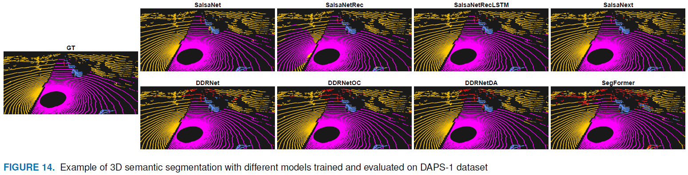
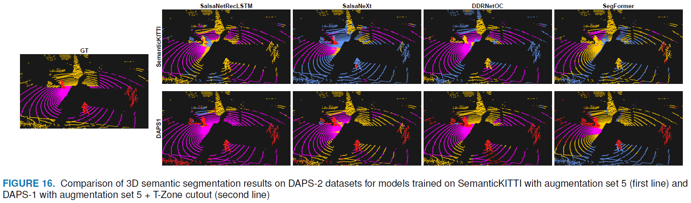

# DAPS3D: Domain Adaptive Projective Segmentation of 3D LiDAR Point Clouds

 

[Alexey Klokov](),
[Di Un Pak](),
[Aleksandr Khorin](https://www.linkedin.com/in/alex-khorin/),
[Dmitry Yudin](),
[Leon Kochiev](),
[Vladimir Luchinskiy](),
[Vitaly Bezuglyj]()

[[`arXiv`]()] [[`pdf`]()] [[`BibTeX`](#citation)]

This repo contains the code for our paper **DAPS3D: Domain Adaptive Projective Segmentation of 3D LiDAR Point Clouds**.

## Abstract
LiDARs are one of the key sources of reliable environmental ranging information for autonomous vehicles. Segmentation of 3D scene elements (roads, buildings, people, cars, etc.) based on LiDAR point clouds has limitations. On the one hand, point- and voxel-based segmentation neural networks have insufficiently high speed. On the other hand, modern labeled datasets mainly contain street scenes recorded for driverless cars and few datasets for mobile delivery robots or cleaners that must work in parks and yards with heavy pedestrian traffic. This article aims to overcome these limitations.
We have proposed a novel approach called DAPS3D to training a deep neural networks for 3D semantic segmentation based on a spherical projection of a point cloud and LiDAR-specific masks, which keeps the model working when changing the type of LiDAR.
First of all, we proposed various high-speed multi-scale spherical projection segmentation models, including convolutional, recurrent, and transformer architectures.
Secondly, we proposed a number of original augmentations of spherical projections of LiDAR data, including FoV, flip and rotation augmentation, as well as a special T-Zone cutout, which provide an increase in the model invariance  when changing the data domain.
Finally, we introduce a new method to generate synthetic datasets for a domain adaptation problem. According this we have developed two new data sets for validating 3D scene outdoor segmentation algorithms: the DAPS-1 dataset based on the augmentation of the reconstructed 3D semantic map, the DAPS-2 LiDAR dataset, collected by the on-board sensors of the cleaning robot in the park area.
Particular attention is paid to the performance of the developed models, which demonstrates the possibility of their functioning in real time. 

## ToDo List

- [x] Release code
- [x] Document for Installation
- [x] Document for Dataset Preparation
- [x] Document for Testing and Training
- [x] Evaluation
- [x] Release trained models
- [x] Release datasets: DAPS-1 & DAPS-2

## Installation Instructions
- We use conda environments 
- We use different Python and PyTorch versions for our models
- For complete installation instructions, please see [Installation](INSTALL.md).

## Dataset Preparation
- We release our [DAPS-1](DATASET.md#daps-1) and [DAPS-2](DATASET.md#daps-2) datasets.
- We also experiment on SemanticKITTI and RELLIS-3D datasets.
- Please see [Datasets Preparation](DATASET.md#datasets-preparation) for complete instructions for preparing the datasets.

## Execution Instructions

### Training
- We train all our models using 2 × RTX 2080Ti (11 GB each) GPUs.
- Please see [Getting Started](GETTING_STARTED.md) for training commands.

### Evaluation

- Please see [Getting Started](GETTING_STARTED.md) for evaluation commands.

## Results
You can find our pretrained models in [Getting Started](GETTING_STARTED.md).

### DAPS-1

All models are trained with augmentation set 5 with T-Zone (see our [Paper]())

| Model | $mIoU$, % | $IoU$[vehicle], % | $IoU$[human], % | $IoU$[surface], % | $IoU$[obstacle], % |
|   :---| :---:   |  :---: |    :---:   |    :---:   |    :---:   |
| SalsaNet | <ins>0.867</ins> | **0.880** | 0.646 | <ins>0.989</ins> | <ins>0.953</ins> |
| SalsaNetRec | 0.850 | 0.836 | <ins>0.680</ins> | 0.974 | 0.908 |
| SalsaNetRecLSTM | 0.862 | <ins>0.878</ins> | 0.632 | 0.988 | 0.949 |
| SalsaNext | **0.886** | <ins>0.878</ins> | **0.721** | **0.990** | **0.954** |
| DDRNet | 0.690 | 0.773 | 0.126 | 0.977 | 0.886 |
| DDRNetOC | 0.694 | 0.769 | 0.138 | 0.978 | 0.889 |
| DDRNetDA | 0.691 | 0.770 | 0.129 | 0.977 | 0.886 |
| Segformer | 0.530 | 0.495 | 0.052 | 0.909 | 0.665 |

### DAPS-2

These are inference results on [DAPS-2](./DATASET.md#daps-2) for the models trained on different datasets.

#### Models trained on SemanticKITTI
| Model | $mIoU$, % | $IoU$[human], % | $IoU$[surface], % | $IoU$[obstacle], % |
|   :---| :---:   |  :---: |    :---:   |    :---:   |
| SalsaNet | **0.405** | 0.056 | 0.662 | **0.498** |
| SalsaNetRec | 0.267 | 0.034 | 0.478 | 0.290 |
| SalsaNextRecLSTM | 0.338 | 0.075 | 0.565 | <ins>0.373</ins> |
| SalsaNext | 0.258 | 0.074 | 0.423 | 0.277 |
| DDRNet | 0.345 | <ins>0.080</ins> | **0.768** | 0.187 |
| DDRNetOC | 0.323 | 0.015 | <ins>0.739</ins> | 0.216 |
| DDRNetDA | <ins>0.369</ins> | 0.040 | 0.705 | 0.361 | 
| Segformer | 0.230 | **0.166** | 0.182 | 0.343 |

#### Models trained on SemanticKITTI + RELLIS-3D
| Model | $mIoU$, % | $IoU$[human], % | $IoU$[surface], % | $IoU$[obstacle], % |
|   :---| :---:   |  :---: |    :---:   |    :---:   |
| SalsaNet | **0.712** | 0.733 | <ins>0.760</ins> | **0.643** |
| SalsaNetRec | 0.481 | 0.446 | 0.590 | 0.406 |
| SalsaNextRecLSTM | <ins>0.689</ins> | <ins>0.770</ins> | **0.761** | 0.537 |
| SalsaNext | 0.663 | **0.799** | 0.684 | 0.505 |
| DDRNet | 0.580 | 0.697 | 0.535 | 0.509 |
| DDRNetOC | 0.616 | 0.724 | 0.586 | <ins>0.539</ins> |
| DDRNetDA | 0.541 | 0.614 | 0.507 | 0.503 |
| Segformer | 0.290 | 0.412 | 0.054 | 0.404 |

#### Models trained on DAPS-1
| Model | $mIoU$, % | $IoU$[human], % | $IoU$[surface], % | $IoU$[obstacle], % |
|   :---| :---:   |  :---: |    :---:   |    :---:   |
| SalsaNet | 0.575 | 0.479 | 0.741 | 0.504 |
| SalsaNetRec | 0.609 | <ins>0.596</ins> | <ins>0.748</ins> | 0.482 |
| SalsaNextRecLSTM | <ins>0.624</ins> | 0.532 | **0.783** | 0.557 |
| SalsaNext | **0.643** | **0.706** | 0.620 | **0.602** |
| DDRNet | 0.516 | 0.354 | 0.737 | 0.458 |
| DDRNetOC | 0.562 | 0.403 | 0.705 | <ins>0.577</ins> | 
| DDRNetDA | 0.531 | 0.360 | 0.718 | 0.515 |
| Segformer | 0.393 | 0.355 | 0.418 | 0.407 |

## Citation
If you found DAPS3D useful in your research, please consider starring ⭐ us on GitHub and citing 📚 us in your research!

## Licence
This repository is released under MIT License (see [LICENSE](./LICENSE) file for details).

